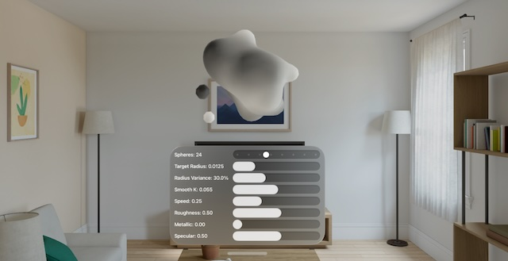

# Matt's Marching Cubes

This project demonstrates Matt Pfeiffer's Marching Cubes sample code in visionOS.

He said;
<pre>
RealityKit experiment #77: Color-blending metaballs created from animated sphere SDFs via Marching Cubes.
LowLevelMesh vertices store per-vertex color in the Geometry Color vertex attribute, read by ShaderGraphMaterial.
</pre>

- Matt Pfeiffer's original source code on Gist: https://gist.github.com/Matt54/bcc31136f2fb4afe3941f43333b5be97

(I tested this with Xcode 26.0 beta and visionOS 26 beta on a simulator and a device.)

I modified the value of 'cellsPerAxis' from 80 to 40, to avoid memory issues.

## License

The license for Matt Pfeiffer's original source code follows his, and everything else is under the MIT license.

since Aug, 2025
